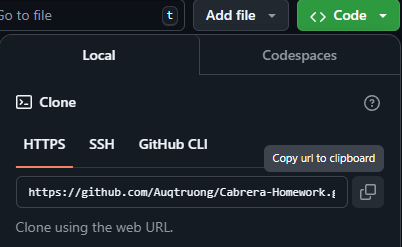
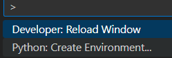
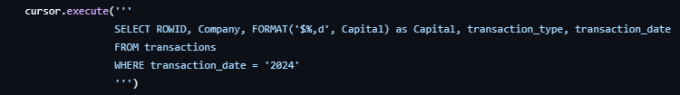

# Description
- This is a small project to analyze some of Cabrera's past financial transactions using Python, Flask, and the built-in SQLite3 library.

# How to Run
1. Clone GitHub Repository using HTTPS 
2. Create/Open the directory where you want the cloned repository
3. Enter in `git clone https://github.com/Auqtruong/Cabrera-Homework.git` into the IDE terminal
4. Use the command `Ctrl+Shift+P` to open the Command Pallete
5. Select `Python: Create Environment` 
   &emsp; 
6. Install Flask using `python -m pip install flask` in the terminal
7. Create an isolated environment using `virtualenv env` 
8. Activate the virtual enviornment using `.venv\Scripts\Activate.ps1`
9. Run the `main.py` file first in order to 
    - Create the database connection
    - Create the table
    - Populate the table with values to be displayed
10. Run the program using `python -m flask run`
11. Check localhost:5000 or http://127.0.0.1:5000 in your browser to see the database table and its displayed values

# Changing Display Outputs
1. To change the output/records seen in the table on localhost:5000 or http://127.0.0.1:5000, alter <b>only</b> the `app.py` file line `12` where it has the `cursor.execute('''[YOUR SQL QUERY HERE]'''`
2. Save your file changes after changing any part of the SQL query
3. Use `Ctrl+C` to kill localhost and rerun the the program using `python -m flask run`
4. Check localhost:5000 or http://127.0.0.1:5000 in your browser to see the changes made to display values